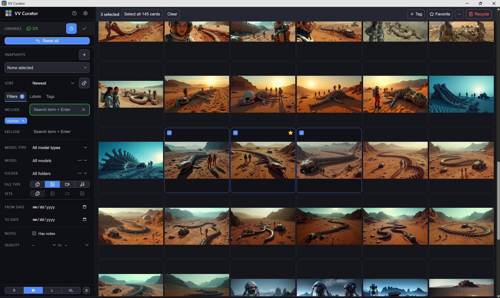
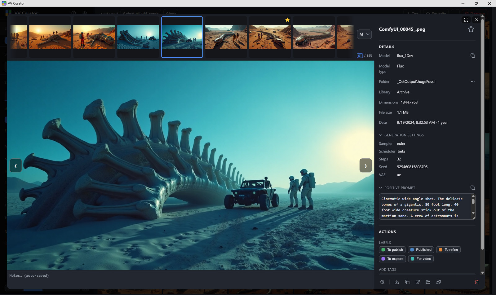

# VV Curator

**A curation tool for people who generate with ComfyUI and end up drowning in their own output.**

Point it at one folder and you can scroll everything underneath it — every subfolder, in one grid,
with no opening folders one at a time. It reads the workflow ComfyUI embeds in your files, so the
whole library becomes searchable by prompt, model and LoRA — then helps you finish the job: collapse
a run into one card, mark the keeper, recycle the rest, and export the good ones with Civitai metadata.

Built and used against **110k+ files across five libraries** — two local, three on network
shares.

**The base app, with no extensions switched on, is local only. Nothing leaves your machine.** There
is no account and no telemetry. Its one outbound request is at startup, asking GitHub whether a
newer version has been released. It sends nothing about you or your library, never downloads or
installs anything, asks before the first one, and can be switched off in Settings.

**Extensions are optional, arrive switched off, and each says what it sends.** The one that ships,
*Post to Civitai*, sends the files you choose and your Civitai API key to Civitai, and only when you
press Post.

**New here?** [About VV Curator](ABOUT.md) — what it's for, and whether it's for you.

---

<!--
  THE BETA SECTION IS TEMPORARY and comes out when the beta ends. Nothing else points at it, which
  is why this reminder is here.

  TAKE THE ISSUES LINK WITH YOU when you delete this section — it is the only place the README says
  where to report anything, and the Accessibility paragraph below asks people to report and stays.
  Removing the beta section as written would leave two requests to report and no address.

  The Accessibility section below it is NOT temporary — keep it when the beta section goes. It is
  deliberately three sentences. It was once a four-bullet audit with contrast ratios in it, which
  is what "update it as things get checked" turns into; if something is fixed, say so in a clause,
  not a new bullet.
-->
## This is the first beta

This has only ever run on one machine, against one library. **The most useful thing you can report
is whether it reads *your* files** — if images come up with no prompt or no model where you expect
one, say so. That is the subsystem everything else hangs off.

Also worth reporting: **A1111 / Forge output** (genuinely untested — one person with a Forge folder
settles it), speed on your library, anything that assumes someone else's filename or folder habits,
and anything you couldn't work out from the interface. That last one is a bug in the UI, not in you.

Say how it went even if it went fine. There is no telemetry, so your report is the only way any of
this is known.

**Report it here:** [github.com/vidi-vinci/vv-curator/issues](https://github.com/vidi-vinci/vv-curator/issues).
One place, so nothing gets lost in a comment thread. No template to fill in — a sentence is fine.

## Accessibility

Not tuned for accessibility yet, though contrast is now measured in both themes and meets WCAG 2.1
AA — text, and the edges of the things you click; keyboard reach and focus visibility are still
unchecked. The one thing worth knowing:
**curation labels carry their name as well as their colour**, so the core workflow doesn't depend on
telling green from amber.

If something specific stops you using it, please report it — a named problem is what gets fixed.

## Getting started

Needs **Windows**, **Python 3.8+** on your PATH, and a **Chromium-based browser** (Chrome, Edge,
Brave…). Firefox works but opens a normal tab instead of the app window.

**On macOS or Linux** it may well run — everything but the launcher is portable — with
`pip install -r requirements.txt` then `python server.py`, opening the address it prints. You'd lose
the app window and the *Show in Explorer* buttons. Completely untested, so treat it as an
experiment; if you try it, [say how it went](https://github.com/vidi-vinci/vv-curator/issues).

1. **Download it** from the [latest release](https://github.com/vidi-vinci/vv-curator/releases/latest)
   — the file called **`VV_Curator_<version>.zip`**. There is no separate build; that is the app.
2. Unzip the folder anywhere — it runs from where you put it. There is no installer.
   **Right-click the zip → Properties → tick Unblock → Apply, before extracting.** Windows marks
   downloaded files and may refuse to run `start.bat`; unblocking the zip clears every file inside
   it at once.
3. Double-click **`start.bat`**.
4. Add a folder of images when the app asks.

On first run it installs three Python packages — **Pillow**, **Send2Trash** and **imageio-ffmpeg** —
into the Python you already have. Everything else is standard library, and the frontend is vanilla JS
with no build step. The first index takes a while on a large library, then it starts in about a second.

To remove it: delete the folder — your index, curation and settings go with it, and your library
stays where it is. Two things sit elsewhere by nature: the three packages above, which live with
your Python, and a few view preferences your browser keeps for the page.

<!--
  STACKED, NOT SIDE BY SIDE. GitHub renders README images at about 800px, so a two-column table
  gives each shot ~400px -- a third of its real size, and the detail panel's values turn to mush.
  Full width each, in exchange for a little scrolling.

  They are JPEGs at 1600px rather than full-size PNGs: the originals were 6.4MB together, and these
  ship in the tester zip as well as the repo, where that would have tripled the download for two
  pictures anyone can see on GitHub. 620KB the pair, and at half size the difference is invisible.
-->

*Everything under one folder in one grid, filtered by prompt, with the rail that does it on the left.*

*Open a card and every setting the file recorded is there, with the prompt.*

## What it does

- **Search every folder at once** — by prompt, model, LoRA, folder, filename, type or date, across
  every library you've added.
- **A generation is one card.** The stills and the video from a single run collapse to one thumbnail,
  so a run reads as one thing rather than six. Mark the keeper, recycle the rest, and apply that same
  decision to every matching set in the folder.
- **Export for Civitai** — a copy whose metadata Civitai reads, with your checkpoint and LoRAs
  auto-linked by hash. Or get it right at generation time with the companion nodes.
- **Curate with one keystroke** — a status for what a file needs next, flags for what is true about
  it, tags, notes, and hand-picked Groups.
- **Post to Civitai** — send a selection up as one draft, without leaving the app. An optional
  extension, switched off until you turn it on.
- **Shuffle the whole library.** A random order that never repeats or skips as you page through it —
  the best way to turn up things you'd forgotten you made.
- **Save a Snapshot** — capture an entire filter state under a name and come back to it.
- **Recycle safely** — to the Recycle Bin, or a `_ToRecycle` folder on network shares, with a
  5-second undo. Duplicates can be found across every folder and culled without losing your curation.
- **Back into ComfyUI** — drag any card onto the canvas to reload its workflow, or open it in one
  click with the companion nodes installed.
- **Not just PNGs.** Video and audio are indexed and played, with their settings read from inside the
  file; songs get a drawn card instead of a thumbnail; and downloaded JPEGs and WebPs keep their
  prompt, model and LoRAs in EXIF, which is read too — including images saved from Civitai, which
  record theirs differently from everyone else.

Indexes PNG, JPG, WebP and GIF, video (MP4, WebM, MOV) and audio (MP3, FLAC, WAV, Opus, M4A). The
embedded workflow is a bonus on the formats that carry one — files without metadata are browsable
like any other.

## Posting to Civitai

It needs a Civitai API key, set up once:

1. On Civitai, go to **Settings → Security & Apps → API Keys** and create a new key. Give it
   **Media & Posts** read and write, and **Profile** read. Leave **AI Services** write off: it can
   spend Buzz.
2. Save the key somewhere safe, such as a password manager.
3. In VV Curator, open **Settings → Extensions**, switch on **Post to Civitai**, and paste the key
   into its page.

Then select files and choose **Post to Civitai…** from the selection bar's `⋯` menu. They go up as
one draft, and nothing is public until you publish it on Civitai.

## The ComfyUI companion

`comfy_vv_saver/` is a **separate package**, not part of the viewer. It writes Civitai-ready metadata
at generation time and stamps a shared run code into filenames, which is what lets the viewer group a
generation exactly rather than guessing. It also carries a small **bridge** that opens a workflow in
ComfyUI in one click — not a node, and it adds nothing to your node menu.

The viewer works fine without it. It has [its own README](comfy_vv_saver/README.md).

## More

[About](ABOUT.md) is what it's for and whether it's for you. [Help](docs/help.md) — the app's own
**?** — holds keys, defaults and gotchas, and is authoritative for behaviour, and
[DESIGN.md](DESIGN.md) covers the token and component system.
Behavioural limits are listed under [Known gaps](docs/help.md#known-gaps) —
chiefly that a video's prompt often can't be read from the file, and WebM carries none.

`python tests/run_all.py` runs the tests in about a minute; each file's docstring says what it pins
and why.

A personal tool, shared as-is: [MIT licensed](LICENSE), no pull requests, no support commitment. The
full statement is in [About](ABOUT.md#what-to-expect-from-this-project).

## A note from me

Yes, this is vibe-coded. I'm not a developer, and it's the first thing I've released.

But I built it for myself, and I use it every day. Everything here has run against a real library of
110k+ images I've generated in ComfyUI over the last two years, plus real photos. I tried to find an
existing solution, but nothing suited my needs. This app has helped me finally wrangle my thousands
of local ComfyUI generations.

It represents months of iterations and refinement, including two earlier versions that I ditched
before I landed on this overall design.

If you find it useful, great. If it breaks, tell me, and thanks in advance for your patience.

VidiVinci
